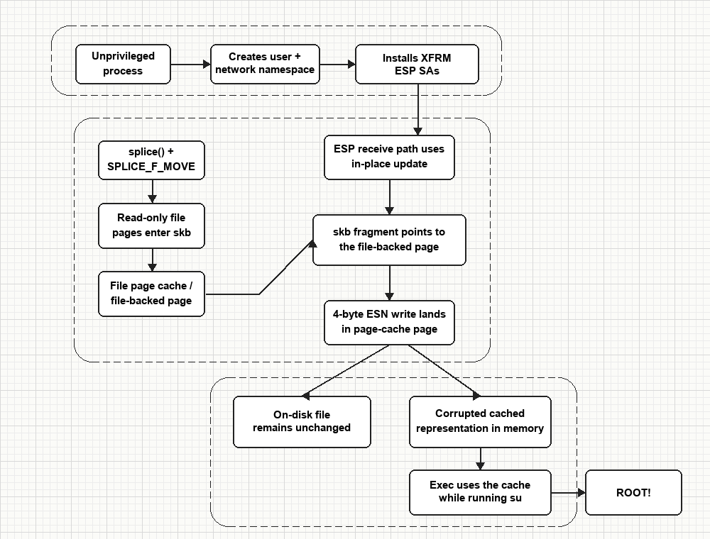

# Dirty Frag / CVE-2026-43284 — Research Notes

## Overview

This repository contains a cleaned-up technical diagram and supporting notes for the Linux kernel vulnerability commonly referred to as **Dirty Frag** and tracked for the xfrm-ESP path as **CVE-2026-43284**.

The issue belongs to the broader **Dirty Frag** class discovered by Hyunwoo Kim ([@v4bel](https://github.com/V4bel)). A related RxRPC variant is tracked separately as **CVE-2026-43500**.

The purpose of this material is:

- to explain the bug mechanism at a systems level;
- to document the relationship between XFRM ESP, UDP encapsulation, `splice()`, `skb` fragments, file-backed pages, and page cache corruption;
- to provide a publication-ready diagram for reports, case studies, and defensive briefings.

This repository is **not** an exploitation guide.

In practical terms, the repository expands and documents the original public Dirty Frag ESP proof-of-concept in a more inspectable C++ form. The included materials are intended for **64-bit Linux systems only**.

---

## How it works

At a high level, the issue is tied to **faulty in-place handling** in the xfrm ESP receive path.

The chain looks like this:

1. a local unprivileged process enters a new user and network namespace with `unshare(CLONE_NEWUSER | CLONE_NEWNET)`;
2. XFRM Security Associations are installed through a Netlink socket;
3. each Security Association stores 4 bytes of a small 192-byte ELF payload in the Extended Sequence Number state;
4. read-only pages from `/usr/bin/su` are moved into a UDP packet path through `splice()` and `SPLICE_F_MOVE`;
5. the packet carries a file-backed page as an `skb` fragment;
6. the ESP receive path performs an in-place replay-window update where the fragment page is treated as writable;
7. 4-byte writes land in the page-cache-backed page;
8. the **on-disk file remains unchanged**, but the **cached in-memory representation becomes corrupted**;
9. later execution may use the modified variant instead of clean on-disk contents.

---



---

## What this repo contains

- `poc/dirtyfrag_sim.cpp` — cleaned-up C++ research source artifact
- `poc/dirtyfrag` — compiled 64-bit C++ binary artifact
- `gen.py` — local Python diagram generator
- `docs/dirtyfrag-flow.png` — generated publication diagram
- `docs/dirtyfrag-flow.mmd` — Mermaid source diagram retained for reference

## Binary build

The repository also includes a compiled C++ binary artifact built from the C++ source file. Example build command:

```bash
g++ -std=c++17 -o poc/dirtyfrag poc/dirtyfrag.cpp
```

---

## Affected versions

Kernels from `cac2661c53f3` (2017-01-17) up to `f4c50a4034e6` (2026-05-05, fix released).

The effective exposure window for the ESP path is about 9 years.

## Disclaimer

This repository is provided for defensive research, documentation, and educational analysis only.

Do not use it to target real systems, modify privileged executables, or obtain unauthorized access.

The vulnerability class was discovered by **Hyunwoo Kim (@v4bel)**. This repository is an independent cleaned-up research artifact intended for faster analysis.

---

## References

- Original Dirty Frag research and chain: [V4bel/dirtyfrag](https://github.com/V4bel/dirtyfrag)
- Original write-up: [dirtyfrag write-up](https://github.com/V4bel/dirtyfrag/blob/master/assets/write-up.md)
- Kernel fix for CVE-2026-43284: commit `f4c50a4034e6`